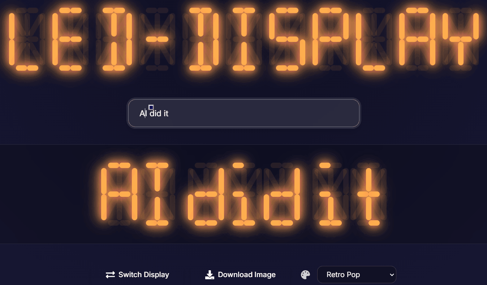

# LED Display

English | [简体中文](./README.md)

A modern LED segment display built with Next.js and React, featuring neon light effects and gradient title animations. Supports both 7-segment and 16-segment display modes.

🔗 Live Demo: [https://segment-code.vercel.app/](https://segment-code.vercel.app/)



## Features

- 🌈 Gradient title animation effects
- 💡 Neon light glow effects
- ⌨️ Real-time segment display
- 🎯 Support for numbers and letters
- 🔄 Toggle between 7-segment and 16-segment modes
- 💾 Save display as image
- 🎨 Modern UI design

## Tech Stack

- **Frontend Framework**:
  - Next.js 14.1.0
  - React 18.2.0
  - TypeScript

- **Styling Solutions**:
  - Tailwind CSS
  - CSS3 Animations
  - CSS Custom Properties (CSS Variables)

- **Key Technologies**:
  - CSS Grid/Flexbox Layout
  - CSS Animations and Transitions
  - TypeScript Type System
  - React Hooks
  - Component-based Development
  - HTML5 Canvas (for image export)

## Project Structure

```
segment-code/
├── app/
│   ├── components/
│   │   └── SegmentDisplay.tsx    # Segment display component
│   ├── styles/
│   │   └── SegmentDisplay.css    # Segment styles
│   ├── layout.tsx               # Layout component
│   └── page.tsx                 # Main page
├── package.json
├── tsconfig.json
└── README.md
```

## Local Development

1. Clone the repository
```bash
git clone [repository-url]
cd segment-code
```

2. Install dependencies
```bash
npm install
```

3. Start the development server
```bash
npm run dev
```

4. Open http://localhost:3000 in your browser

## Usage Guide

1. **Input Text**: Enter numbers or letters in the input field
2. **Toggle Display Mode**: Click the toggle button in the bottom right corner to switch between 7-segment and 16-segment modes
3. **Download Image**: Click the download button to save the current display as a PNG image
4. **Multiple Words**: Use spaces to separate different words

## Implementation Details

### Segment Display

- CSS Grid layout for segment arrangement
- Dynamic color control using CSS variables
- Neon light effects using box-shadow
- Support for both 7-segment and 16-segment displays
- Complete mapping for letters and numbers

### Animation Effects

- Title floating animation
- Neon light flicker effect
- Gradient color transitions
- Smooth state transitions
- Button interaction animations

### Image Export

- Segment display image export using html2canvas
- Transparent background support
- High-resolution output (2x scaling)

## Contributing

Issues and Pull Requests are welcome!

## License

MIT License

## Acknowledgments

- Next.js Team
- React Community
- Tailwind CSS Team
- html2canvas Project 